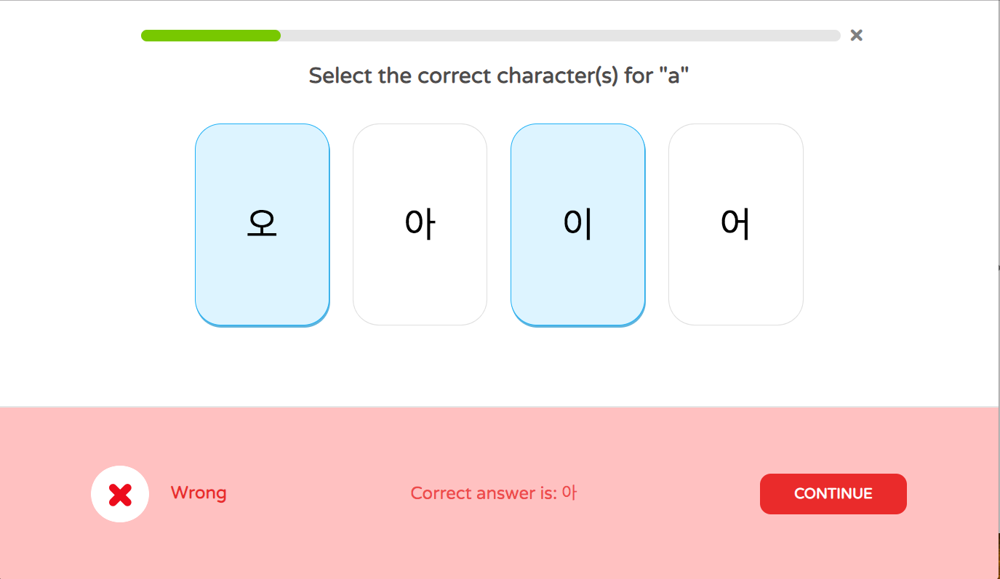
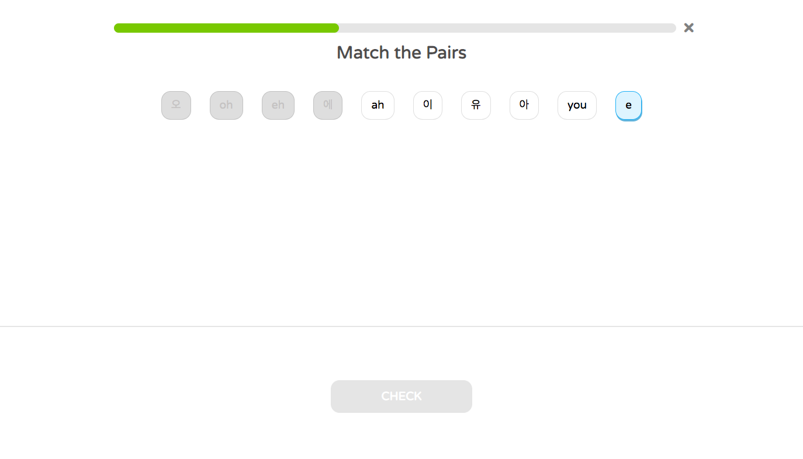
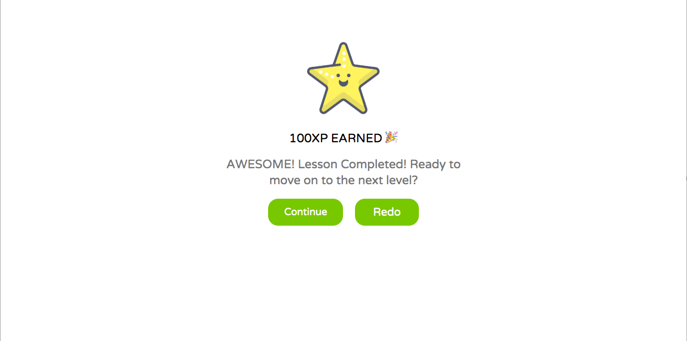

# Kolingo
[Kolingo](http://kolingo-app.herokuapp.com/) was inspired by Duolingo, a language-learning platform that provides users to learn different languages. Similarly to Duolingo, Kolingo features different levels of lessons for users to learn korean.


## Technologies Used
* Kolingo was created with Express & Node on the backend using a Mongodb database and React/Redux on the frontend.

## Key Features

### `Displays correct answers`

When user chooses the wrong answer, it will display the correct answer to the user.

### `Match the pairs`

User is able to click correct pairs. 

### `Goal Page`

If user is logged in, they are able to earn points to move on to the next lesson. 

### To get started

Install project dependencies:

```sh
$ npm install
```
Start the app:

```sh
$ npm start
```

## Future Plans
* Implement ability for users to upload profile pictures
* Build a dictionary page for users to search the words
* Ability to interact with friends

